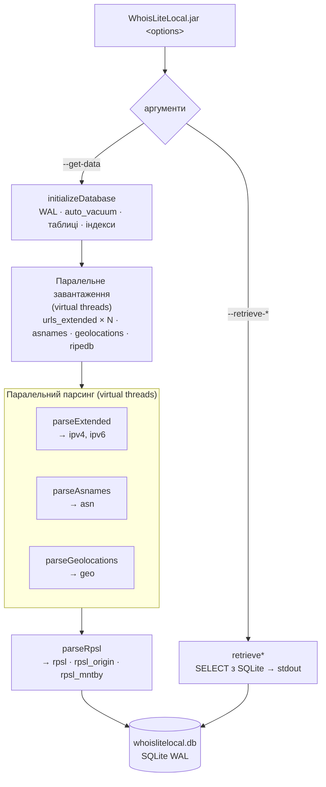

# whois-lite-local

Утиліта для роботи з extended-файлами RIR (RIPE NCC, ARIN, APNIC, LACNIC, AFRINIC), а також `ripe.db`, asnames та geolocations. Завантажує дані, парсить їх та зберігає у локальній SQLite-базі з підтримкою запитів за ASN, AS-set, мейнтейнером, організацією та IP-мережами.

## Документація

📋 [Changelog](CHANGELOG.md) · 🛠 [Contributing](CONTRIBUTING.md) · ⛁ [Структура бази даних](docs/DATABASE.md)

## Збірка

**Вимоги:** Java 21+, Maven 3.6+

```bash
mvn clean install
```

> **Увага для систем з непрацюючим IPv6:** якщо Maven не може завантажити залежності з Maven Central, додайте прапор `-Djava.net.preferIPv4Stack=true`:
> ```bash
> MAVEN_OPTS="-Djava.net.preferIPv4Stack=true" mvn clean install
> ```
> Щоб не вводити щоразу: `echo 'MAVEN_OPTS="-Djava.net.preferIPv4Stack=true"' >> ~/.mavenrc`

## Конфігурація

Перед збіркою створіть файл `src/main/resources/whoislitelocal.properties`
(він виключений з git — `.gitignore` — оскільки містить приватні URL дзеркал).

Файл **вбудовується у JAR** під час збірки (`mvn package`) і завантажується з classpath —
тому зібраний JAR можна запускати з будь-якої директорії.

Файл має рівно **чотири ключі**; значення кожного — URL або список URL через кому:

```properties
# Extended-файли делегувань від усіх RIR (через кому якщо їх кілька)
urls_extended=https://example.com/delegated-ripencc-extended-latest,\
              https://example.com/delegated-arin-extended-latest

# Файл з назвами AS (asnames)
asnames=https://example.com/asn.txt

# Файл геолокацій
geolocations=https://example.com/geolocations.csv

# RPSL-дамп бази даних (ripe.db або аналог)
ripedb=https://example.com/ripe.db.gz
```

## Usage

```bash
java -jar WhoisLiteLocal-1.0.0.jar [options]
```

| Опція | Коротка | Аргумент | Опис |
|---|---|---|---|
| `--get-data` | `-gd` | — | Завантажити та обробити дані з налаштованих URL |
| `--retrieve-aut-num` | `-ran` | `<as-num>` | Отримати інформацію про aut-num об'єкт та пов'язані об'єкти |
| `--retrieve-as-set` | `-ras` | `<as-set>` | Отримати інформацію про as-set об'єкт |
| `--retrieve-mntner` | `-rm` | `<mntnr>` | Отримати інформацію про mntner та пов'язані об'єкти |
| `--retrieve-mnt-by` | `-rmb` | `<mntnr>` | Отримати об'єкти під управлінням вказаного мейнтейнера |
| `--retrieve-organisation` | `-ro` | `<as-num>` | Отримати інформацію про організацію для вказаного aut-num |
| `--retrieve-route-origin` | `-rro` | `<AS-num>` | Отримати route/route6 об'єкти із вказаним origin |
| `--retrieve-network-origin` | `-rno` | `<net-num>` | Отримати route/route6 об'єкти для вказаної мережі |
| `--help` | `-h` | — | Показати довідку |

## Алгоритм роботи



## Паралелізм

`--get-data` виконує роботу у два рівні паралелізму:

**Завантаження (Java virtual threads):** усі файли, що потребують оновлення, завантажуються одночасно.  Для `urls_extended`, де налаштовано кілька RIR-файлів, всі HTTP GET виконуються паралельно.

**Парсинг:** `parseExtended`, `parseAsnames` та `parseGeolocations` записують у різні таблиці (`ipv4`/`ipv6`, `asn`, `geo`) і виконуються паралельно. `parseRpsl` запускається після них, оскільки використовує TEMP-таблиці для порівняння з існуючими даними.

SQLite працює в режимі WAL (`PRAGMA journal_mode = WAL`) з `busy_timeout = 30000 мс`, що дозволяє паралельним з'єднанням коректно чекати на звільнення блокування запису.

## Примітки

> `src/main/resources/schema.sql` є довідковим артефактом і **не використовується** під час роботи програми. Актуальна схема БД формується кодом (`initializeDatabase.java`) при першому запуску. Детальний опис схеми — у [docs/DATABASE.md](docs/DATABASE.md).
