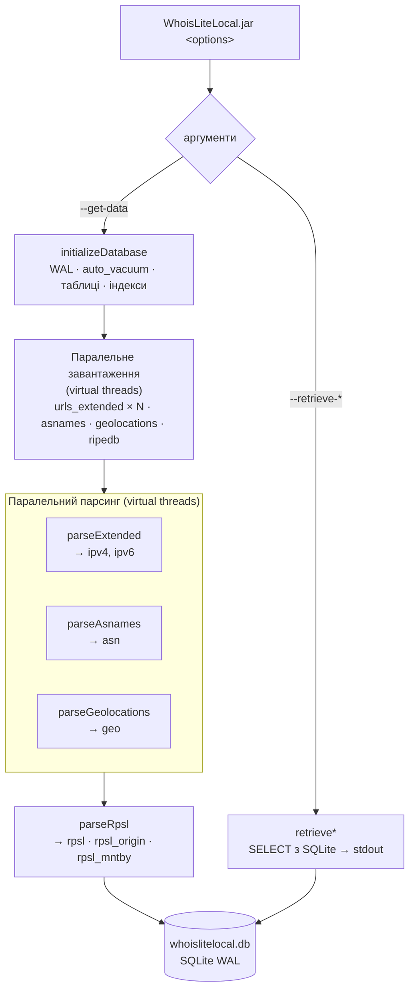

# whois-lite-local

Утиліта для роботи з extended-файлами RIR (RIPE NCC, ARIN, APNIC, LACNIC, AFRINIC), а також `ripe.db`, asnames та geolocations. Завантажує дані, парсить їх та зберігає у локальній SQLite-базі з підтримкою запитів за ASN, AS-set, мейнтейнером, організацією та IP-мережами.

## Документація

📋 [Changelog](CHANGELOG.md) · 🛠 [Contributing](CONTRIBUTING.md) · ⛁ [Database](docs/DATABASE.md)

## Збірка

**Вимоги:** Java 21+, Maven 3.6+

```bash
mvn clean install
```

> **Увага для систем з непрацюючим IPv6:** якщо Maven не може завантажити залежності з Maven Central, додайте прапор `-Djava.net.preferIPv4Stack=true`:
> ```bash
> MAVEN_OPTS="-Djava.net.preferIPv4Stack=true" mvn clean install
> ```
> Щоб не вводити щоразу: `echo 'MAVEN_OPTS="-Djava.net.preferIPv4Stack=true"' >> ~/.mavenrc`

## Конфігурація

Перед збіркою створіть файл `src/main/resources/whoislitelocal.properties`
(він виключений з git — `.gitignore` — оскільки містить приватні URL дзеркал).

Файл **вбудовується у JAR** під час збірки (`mvn package`) і завантажується з classpath —
тому зібраний JAR можна запускати з будь-якої директорії.

Файл має рівно **чотири ключі**; значення кожного — URL або список URL через кому:

```properties
# Extended-файли делегувань від усіх RIR (через кому якщо їх кілька)
urls_extended=https://example.com/delegated-ripencc-extended-latest,\
              https://example.com/delegated-arin-extended-latest

# Файл з назвами AS (asnames)
asnames=https://example.com/asn.txt

# Файл геолокацій
geolocations=https://example.com/geolocations.csv

# RPSL-дамп бази даних (ripe.db або аналог)
ripedb=https://example.com/ripe.db.gz
```

## Usage

```bash
java -jar WhoisLiteLocal-1.0.0.jar [options]
```

| Опція | Коротка | Аргумент | Опис |
|---|---|---|---|
| `--get-data` | `-gd` | — | Завантажити та обробити дані з налаштованих URL |
| `--retrieve-aut-num` | `-ran` | `<as-num>` | Отримати інформацію про aut-num об'єкт та пов'язані об'єкти |
| `--retrieve-as-set` | `-ras` | `<as-set>` | Отримати інформацію про as-set об'єкт |
| `--retrieve-mntner` | `-rm` | `<mntnr>` | Отримати інформацію про mntner та пов'язані об'єкти |
| `--retrieve-mnt-by` | `-rmb` | `<mntnr>` | Отримати об'єкти під управлінням вказаного мейнтейнера |
| `--retrieve-organisation` | `-ro` | `<as-num>` | Отримати інформацію про організацію для вказаного aut-num |
| `--retrieve-route-origin` | `-rro` | `<AS-num>` | Отримати route/route6 об'єкти із вказаним origin |
| `--retrieve-network-origin` | `-rno` | `<net-num>` | Отримати route/route6 об'єкти для вказаної мережі |
| `--retrieve-route` | `-rr` | `<addr-or-prefix>` | route-об'єкти, що покривають IPv4-адресу або префікс, разом з організацією |
| `--retrieve-route6` | `-rr6` | `<addr-or-prefix>` | route6-об'єкти, що покривають IPv6-адресу або префікс, разом з організацією |
| `--retrieve-inetnum` | `-rin` | `<addr-or-prefix>` | inetnum-об'єкти, що покривають IPv4-адресу, з організацією та вкладеними route |
| `--retrieve-inet6num` | `-ri6n` | `<addr-or-prefix>` | inet6num-об'єкти, що покривають IPv6-адресу, з організацією та вкладеними route6 |
| `--search-rpsl-object` | `-sro` | `<pattern>` | Повнотекстовий пошук по RPSL-об'єктах за шаблоном або regex (case-insensitive) |
| `--vacuum` | `-vc` | — | Виконати повний VACUUM SQLite (після `--get-data` або окремо) |
| `--help` | `-h` | — | Показати довідку |

## Пошук за адресою всередині мережі

Опції `-rr`, `-rr6`, `-rin`, `-ri6n` не вимагають точного значення об'єкта — достатньо будь-якої адреси чи префікса всередині нього:

```bash
java -jar WhoisLiteLocal.jar -ri6n 2a04:42c1:3:c::3/64
```

знайде **усі** inet6num, що покривають цю адресу — і `2a04:42c1::/32`, і зовнішній `2a04:42c0::/29` — від найменш специфічного до найбільш специфічного, кожен з його організацією та вкладеними route6.

Об'єкти цих типів сильно перекриваються, тому пошук побудовано на точних збігах за довжиною маски, а не на діапазонному предикаті: адреса маскується до кожної можливої довжини й шукається в індексі. Це на два порядки швидше за `firstip <= ? AND lastip >= ?`.

## Оновлення з версій до 1.4.0

Додано таблицю `rpsl_net` — міграція автоматична, але **наповнюється вона лише під час наступного `--get-data`**. До того нові опції не знаходитимуть нічого.

> **Увага до розміру.** Разом з `inetnum` та `inet6num` база зростає приблизно втричі: `inetnum` — найчисленніший тип об'єктів у RIPE DB.

## Оновлення з версій до 1.3.0

Схема отримала покривні індекси `idx_ipv4_range` / `idx_ipv6_range` замість чотирьох односторонніх. Міграція автоматична при першому запуску `--get-data`; `--vacuum` поверне звільнене місце.

Завантаження тепер дозволено **лише за `https://`** (звичайний `http://` — тільки на localhost). Якщо у `whoislitelocal.properties` є `http://`-адреси, замініть їх на `https://`, інакше в лозі буде `Refusing to fetch ...: only https:// is allowed`.

## Оновлення з версій до 1.2.0

Схема бази змінилася — до таблиці `rpsl` додано колонку `block_sha512`, у якій кешується хеш блоку. **Видаляти чи перестворювати базу не потрібно**: міграція виконується автоматично при першому запуску `--get-data`.

Що відбудеться один раз:

```
Added column rpsl.block_sha512
Dropped redundant index idx_rpsl_kv (duplicated UNIQUE(key, value))
Backfilling block_sha512 for N rpsl records (one-time migration, this may take a while)...
```

Заповнення хешів для бази ~1 ГБ триває помітний час і більше не повторюється.

Якщо в лозі з'явиться попередження про `auto_vacuum`, виконайте один раз:

```bash
java -jar WhoisLiteLocal.jar --vacuum
```

Це перебудує файл, увімкне інкрементальний auto-vacuum і поверне місце від видаленого індексу.

## Алгоритм роботи


```mermaid
flowchart TD
    CLI["WhoisLiteLocal.jar &lt;options&gt;"] --> dispatch{аргументи}

    dispatch -->|"--get-data"| init["initializeDatabase\nWAL · auto_vacuum · таблиці · індекси"]
    dispatch -->|"--retrieve-*"| ret["retrieve*\nSELECT з SQLite → stdout"]

    init --> par_dl["Паралельне завантаження\n(virtual threads)\nurls_extended × N · asnames · geolocations · ripedb"]

    par_dl --> par_p

    subgraph par_p ["Паралельний парсинг (virtual threads)"]
        direction LR
        p1["parseExtended\n→ ipv4, ipv6"]
        p2["parseAsnames\n→ asn"]
        p3["parseGeolocations\n→ geo"]
    end

    par_p --> rpsl["parseRpsl\n→ rpsl · rpsl_origin · rpsl_mntby"]

    rpsl --> db[("whoislitelocal.db\nSQLite WAL")]
    ret --> db
```

## Паралелізм

`--get-data` виконує роботу у два рівні паралелізму:

**Завантаження (Java virtual threads):** усі файли, що потребують оновлення, завантажуються одночасно.  Для `urls_extended`, де налаштовано кілька RIR-файлів, всі HTTP GET виконуються паралельно.

**Парсинг:** `parseExtended`, `parseAsnames` та `parseGeolocations` записують у різні таблиці (`ipv4`/`ipv6`, `asn`, `geo`) і виконуються паралельно. `parseRpsl` запускається після них, оскільки використовує TEMP-таблиці для порівняння з існуючими даними.

SQLite працює в режимі WAL (`PRAGMA journal_mode = WAL`) з `busy_timeout = 30000 мс`, що дозволяє паралельним з'єднанням коректно чекати на звільнення блокування запису.
