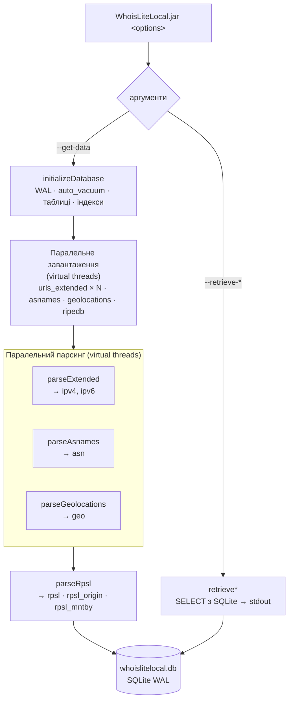

# whois-lite-local

Утиліта для роботи з extended-файлами RIR (RIPE NCC, ARIN, APNIC, LACNIC, AFRINIC), а також `ripe.db`, asnames та geolocations. Завантажує дані, парсить їх та зберігає у локальній SQLite-базі з підтримкою запитів за ASN, AS-set, мейнтейнером, організацією та IP-мережами.

## Документація

📋 [Changelog](CHANGELOG.md) · 🛠 [Contributing](CONTRIBUTING.md) · ⛁ [Database](docs/DATABASE.md)

## Збірка

**Вимоги:** Java 21+, Maven 3.6+

```bash
mvn clean install
```

> **Увага для систем з непрацюючим IPv6:** якщо Maven не може завантажити залежності з Maven Central, додайте прапор `-Djava.net.preferIPv4Stack=true`:
> ```bash
> MAVEN_OPTS="-Djava.net.preferIPv4Stack=true" mvn clean install
> ```
> Щоб не вводити щоразу: `echo 'MAVEN_OPTS="-Djava.net.preferIPv4Stack=true"' >> ~/.mavenrc`

> **Той самий прапор може знадобитися й під час роботи.** Якщо `--get-data` падає з `SSLException: (bad_record_mac) Tag mismatch` або обривами на великих файлах, тоді як `curl` качає їх без проблем, спробуйте:
> ```bash
> java -Djava.net.preferIPv4Stack=true -jar WhoisLiteLocal.jar --get-data
> ```
> Java за замовчуванням віддає перевагу IPv6, а `curl` застосовує Happy Eyeballs і може мовчки піти через IPv4 — тому несправний IPv6-шлях виявляється лише в Java. Завантаження й так повторюється п'ять разів із затримками 15–120 с, але якщо шлях зламаний постійно, повтори не допоможуть.

## Надійність завантаження

`ftp.ripe.net` — публічне дзеркало, і відмови на ньому трапляються: зависле читання, таймаут з'єднання, обрив TLS-сесії. Найчастіше причина в тому, що о 01:00 по ті самі файли приходять усі нічні cron-и, тож дзеркало насичене.

Кожен файл завантажується з п'ятьма спробами, затримки 15 с → 30 с → 60 с → 120 с плюс до 25% джитера (щоб клієнти не поверталися в те саме перевантажене вікно одночасно). Повне вікно — близько чотирьох хвилин.

Якщо файл так і не вдалося отримати, його метадані **не оновлюються** — дані залишаються з попереднього запуску, а наступний запуск спробує знову. Підсумковий рядок у лозі в такому разі має рівень `WARN` і називає кількість пропущених файлів, щоб неповний запуск не виглядав успішним.

### Резервне завантаження через curl

Коли всі внутрішні спроби вичерпані, остання спроба виконується системним `curl`. Причина суто практична: у зафіксованих збоях `curl` качав той самий файл на повній швидкості, тоді як Java падала. Він застосовує Happy Eyeballs (гонка IPv4 проти IPv6) та інший TLS-стек, тож збій, специфічний для будь-чого з двох, не повторюється.

Делегується **лише передача даних** — розбір і розпакування залишаються в коді, бо формат визначається за вмістом файлу, а не за тим, хто його приніс. Правило «тільки https», ліміт розміру й обмеження перенаправлень діють і тут; URL передається окремим аргументом, без оболонки.

Якщо `curl` не встановлено, це не помилка: запуск продовжиться, а файл буде перезавантажено наступного разу.

Умова ввімкнення — **наявність самого `curl`**, а не назва ОС. Один раз на запуск виконується `curl --version`; результат кешується. Перевірка за платформою була б хибною в обидві сторони: мінімальні Linux-образи (alpine, distroless) часто не містять `curl`, а macOS і Windows його, навпаки, постачають:

| Платформа | `curl` у базовій системі |
|---|---|
| Linux | зазвичай є; у мінімальних образах може бути відсутній |
| macOS | `/usr/bin/curl` — є вже багато років |
| Windows | `curl.exe` у `System32` — з Windows 10 build 1803 і в Windows 11 |

У лозі видно, яка гілка обрана: або версія `curl`, або один рядок із назвою ОС і поясненням, що працює лише внутрішній шлях. Перевірено на Linux із `curl` і без нього; дані для macOS та Windows наведено за документацією постачальників, у цьому проекті вони не тестувалися.

## Конфігурація

Перед збіркою створіть файл `src/main/resources/whoislitelocal.properties`
(він виключений з git — `.gitignore` — оскільки містить приватні URL дзеркал).

Файл **вбудовується у JAR** під час збірки (`mvn package`) і завантажується з classpath —
тому зібраний JAR можна запускати з будь-якої директорії.

Файл має рівно **чотири ключі**; значення кожного — URL або список URL через кому:

```properties
# Extended-файли делегувань від усіх RIR (через кому якщо їх кілька)
urls_extended=https://example.com/delegated-ripencc-extended-latest,\
              https://example.com/delegated-arin-extended-latest

# Файл з назвами AS (asnames)
asnames=https://example.com/asn.txt

# Файл геолокацій
geolocations=https://example.com/geolocations.csv

# RPSL-дамп бази даних (ripe.db або аналог)
ripedb=https://example.com/ripe.db.gz
```

## Usage

```bash
java -jar WhoisLiteLocal-1.0.0.jar [options]
```

| Опція | Коротка | Аргумент | Опис |
|---|---|---|---|
| `--get-data` | `-gd` | — | Завантажити та обробити дані з налаштованих URL |
| `--retrieve-aut-num` | `-ran` | `<as-num>` | Отримати інформацію про aut-num об'єкт та пов'язані об'єкти |
| `--retrieve-as-set` | `-ras` | `<as-set>` | Отримати інформацію про as-set об'єкт |
| `--retrieve-mntner` | `-rm` | `<mntnr>` | Отримати інформацію про mntner та пов'язані об'єкти |
| `--retrieve-mnt-by` | `-rmb` | `<mntnr>` | Отримати об'єкти під управлінням вказаного мейнтейнера |
| `--retrieve-organisation` | `-ro` | `<as-num>` | Отримати інформацію про організацію для вказаного aut-num |
| `--retrieve-route-origin` | `-rro` | `<AS-num>` | Отримати route/route6 об'єкти із вказаним origin |
| `--retrieve-network-origin` | `-rno` | `<net-num>` | Отримати route/route6 об'єкти для вказаної мережі |
| `--retrieve-route` | `-rr` | `<addr-or-prefix>` | route-об'єкти, що покривають IPv4-адресу або префікс, разом з організацією |
| `--retrieve-route6` | `-rr6` | `<addr-or-prefix>` | route6-об'єкти, що покривають IPv6-адресу або префікс, разом з організацією |
| `--retrieve-inetnum` | `-rin` | `<addr-or-prefix>` | inetnum-об'єкти, що покривають IPv4-адресу, з організацією та вкладеними route |
| `--retrieve-inet6num` | `-ri6n` | `<addr-or-prefix>` | inet6num-об'єкти, що покривають IPv6-адресу, з організацією та вкладеними route6 |
| `--search-rpsl-object` | `-sro` | `<pattern>` | Повнотекстовий пошук по RPSL-об'єктах за шаблоном або regex (case-insensitive) |
| `--vacuum` | `-vc` | — | Виконати повний VACUUM SQLite (після `--get-data` або окремо) |
| `--force` | `-f` | — | Перезавантажити й перепарсити все, ігноруючи збережені метадані |
| `--help` | `-h` | — | Показати довідку |

## Пошук за адресою всередині мережі

Опції `-rr`, `-rr6`, `-rin`, `-ri6n` не вимагають точного значення об'єкта — достатньо будь-якої адреси чи префікса всередині нього:

```bash
java -jar WhoisLiteLocal.jar -ri6n 2a04:42c1:3:c::3/64
```

знайде **найточніший** inet6num, що покриває цю адресу, разом з його організацією та вкладеними route6.

Повертається саме найточніший збіг, як це робить whois. Інакше кожен IPv4-запит починався б із заглушки `inetnum: 0.0.0.0 - 255.255.255.255`, яку RIPE тримає для непризначених адрес, — і тягнув би за собою всі маршрути, що лежать усередині.

Об'єкти цих типів сильно перекриваються, тому пошук побудовано на точних збігах меж блоку: кожен збережений рядок є CIDR-блоком, тож довжини префікса перебираються від найточнішої до найширшої з зупинкою на першому влучанні. Це на два порядки швидше за `firstip <= ? AND lastip >= ? ORDER BY firstip DESC LIMIT 1`, який у непокритій зоні сканує індекс назад аж до `/0`.

Діапазон, що не зводиться до одного префікса, розкладається на точний набір блоків: `20.33.0.0 - 20.128.255.255` — це сім блоків шести різних розмірів.

## Коли потрібен `--force`

Звичайний запуск звіряє `Last-Modified` і розмір із збереженими в `file_metadata` й пропускає незмінені файли. Це правильно для щоденного оновлення, але має наслідок: **після зміни в тому, що саме видобуває парсер, дані на дзеркалі не змінилися — отже, не завантажиться нічого, і нова логіка не побачить файлів.**

```bash
java -jar WhoisLiteLocal.jar --get-data --force
```

Потрібен після оновлення, яке додає новий тип об'єктів або нову таблицю — інакше довелося б чекати, доки RIPE оновить `ripe.db`.

## Оновлення з версій до 1.4.1

Таблиця `rpsl_net` перебудовується — стара версія видаляється автоматично, але **наповнюється вона лише під час наступного `--get-data`**. Оскільки `ripe.db` на дзеркалі при цьому не змінився, звичайний запуск пропустить завантаження й таблиця залишиться порожньою — потрібен `--get-data --force`.

> **Увага до розміру.** Разом з `inetnum` та `inet6num` база зростає приблизно втричі: `inetnum` — найчисленніший тип об'єктів у RIPE DB.

## Оновлення з версій до 1.3.0

Схема отримала покривні індекси `idx_ipv4_range` / `idx_ipv6_range` замість чотирьох односторонніх. Міграція автоматична при першому запуску `--get-data`; `--vacuum` поверне звільнене місце.

Завантаження тепер дозволено **лише за `https://`** (звичайний `http://` — тільки на localhost). Якщо у `whoislitelocal.properties` є `http://`-адреси, замініть їх на `https://`, інакше в лозі буде `Refusing to fetch ...: only https:// is allowed`.

## Оновлення з версій до 1.2.0

Схема бази змінилася — до таблиці `rpsl` додано колонку `block_sha512`, у якій кешується хеш блоку. **Видаляти чи перестворювати базу не потрібно**: міграція виконується автоматично при першому запуску `--get-data`.

Що відбудеться один раз:

```
Added column rpsl.block_sha512
Dropped redundant index idx_rpsl_kv (duplicated UNIQUE(key, value))
Backfilling block_sha512 for N rpsl records (one-time migration, this may take a while)...
```

Заповнення хешів для бази ~1 ГБ триває помітний час і більше не повторюється.

Якщо в лозі з'явиться попередження про `auto_vacuum`, виконайте один раз:

```bash
java -jar WhoisLiteLocal.jar --vacuum
```

Це перебудує файл, увімкне інкрементальний auto-vacuum і поверне місце від видаленого індексу.

## Алгоритм роботи


```mermaid
flowchart TD
    CLI["WhoisLiteLocal.jar &lt;options&gt;"] --> dispatch{аргументи}

    dispatch -->|"--get-data"| init["initializeDatabase\nWAL · auto_vacuum · таблиці · індекси"]
    dispatch -->|"--retrieve-*"| ret["retrieve*\nSELECT з SQLite → stdout"]

    init --> par_dl["Паралельне завантаження\n(virtual threads)\nurls_extended × N · asnames · geolocations · ripedb"]

    par_dl --> par_p

    subgraph par_p ["Паралельний парсинг (virtual threads)"]
        direction LR
        p1["parseExtended\n→ ipv4, ipv6"]
        p2["parseAsnames\n→ asn"]
        p3["parseGeolocations\n→ geo"]
    end

    par_p --> rpsl["parseRpsl\n→ rpsl · rpsl_origin · rpsl_mntby"]

    rpsl --> db[("whoislitelocal.db\nSQLite WAL")]
    ret --> db
```

## Паралелізм

`--get-data` виконує роботу у два рівні паралелізму:

**Завантаження (Java virtual threads):** усі файли, що потребують оновлення, завантажуються одночасно.  Для `urls_extended`, де налаштовано кілька RIR-файлів, всі HTTP GET виконуються паралельно.

**Парсинг:** `parseExtended`, `parseAsnames` та `parseGeolocations` записують у різні таблиці (`ipv4`/`ipv6`, `asn`, `geo`) і виконуються паралельно. `parseRpsl` запускається після них, оскільки використовує TEMP-таблиці для порівняння з існуючими даними.

SQLite працює в режимі WAL (`PRAGMA journal_mode = WAL`) з `busy_timeout = 30000 мс`, що дозволяє паралельним з'єднанням коректно чекати на звільнення блокування запису.
